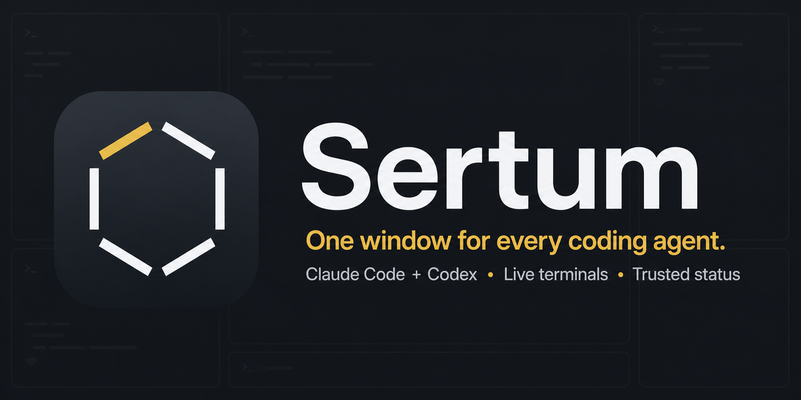

# Sertum

One window for every coding agent you have running.

Sertum is a desktop app for managing Claude Code, Codex, and Grok sessions across
different projects and Git worktrees. Coding agents use a conversation UI;
where an agent still requires a terminal protocol, Sertum keeps that PTY
underneath as an implementation detail. Shell sessions remain real embedded
terminals. Agent events provide reliable at-a-glance status such as working,
idle, or waiting for input.



## What you can do

- Run Claude Code, Codex, and Grok side by side in one desktop window.
- Keep sessions organized by project, folder, and worktree.
- See which agents are working or need attention without reading terminal
  output heuristically.
- Split the window into two or four independently sized panes.
- Review changed files, read per-file diffs, then commit and open a pull
  request without leaving the app.
- Approve or refuse a Claude tool call from a bar above the terminal, and turn
  a decision you keep repeating into a stored permission rule.
- Get a system notification when a session needs you, fired from agent events
  rather than from output going quiet.
- Remap any menu shortcut, with collisions refused before they are saved.
- Create isolated worktree sessions from the New Session dialog.
- Discover supported agent sessions that were started outside Sertum.

## Requirements

Before starting Sertum, install:

- [Node.js](https://nodejs.org/) with npm
- [Git](https://git-scm.com/)
- At least one supported coding agent:
  [Claude Code](https://docs.anthropic.com/en/docs/claude-code),
  [Codex](https://developers.openai.com/codex/), or
  [Grok](https://docs.x.ai/docs/grok-cli)

Optionally, install the [GitHub CLI](https://cli.github.com/) and sign in with
`gh auth login`. Sertum opens pull requests through it, because `gh` already
holds the credential; without it, that one button explains what is missing and
everything else works normally.

Make sure each agent you intend to use is installed and authenticated in your
normal terminal. Sertum searches your `PATH` and known installation locations;
Grok's default `~/.grok/bin` installation is supported even when it is not on
`PATH`.

Sertum's terminal and agent integrations are currently verified on macOS and
Windows.

## Run from source

Clone the repository, install dependencies, and start the Electron app:

```sh
git clone https://github.com/rsimmermon/Sertum.git
cd Sertum
npm install
npm start
```

The Electron Forge startup process rebuilds native dependencies such as
`node-pty` for the installed Electron version when needed.

## Start your first session

1. Launch Sertum with `npm start`.
2. Choose **New Session**.
3. Select a working folder with the native folder picker.
4. Choose Claude Code, Codex, or Grok.
5. Select the desired isolation option. Use the existing folder for ordinary
   work, or create a worktree when the task should be isolated.
6. Start the session and interact with the agent in its chat pane. Plain Shell
   sessions open as embedded terminals.

Sertum resolves installed agent binaries automatically. If an agent is not
found, open **Settings > Agents & permissions** to detect it again or select its executable
manually. Agents that support their own background host also expose a
per-agent **Keep running after Sertum closes** default there; it applies to new
sessions and is off by default.

## Useful commands

```sh
npm start       # Run the app in development mode
npm run lint    # Lint the TypeScript source
npm run package # Build an unpacked application bundle
npm run make    # Create platform-specific distributables
```

On Windows, run `npm run make` under Node 20 LTS. Node 26 exits partway
through packaging without producing an installer and without reporting an
error.

## Current scope

Working: chat sessions and live status for Claude Code, Codex, and Grok,
external session discovery, binary configuration, worktree management,
split-pane layouts, diff review with commit and pull request, permission rules
and in-app tool approval, system notifications, and settings.

Still planned: restoring sessions on launch and per-repository worktree
defaults. Settings shows each of these as a disabled
control explaining what is missing, rather than as a switch that does
nothing.

## Contributing and architecture

The canonical technical guide is [AGENTS.md](AGENTS.md). It documents the
two-plane architecture, process lifecycle, agent adapters, external-session
discovery, worktree behavior, platform details, design references, and known
implementation constraints. It provides shared project context for Claude
Code, Codex, and Grok.

The UI source of truth is `SertumDesigns.pen` at the repository root. Frame
identifiers in source comments refer to frames in that file.
